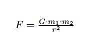
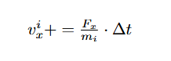
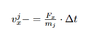
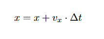
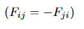

# Symulacja N-ciał na CPU (2-pair method)

## Opis
Projekt implementuje **2-pair method** do symulacji grawitacyjnych interakcji między N ciałami w przestrzeni 3D. 

Implementacja została zoptymalizowana do działania na procesorach (CPU) z użyciem **OpenMP** do równoległego przetwarzania. OpenMP to biblioteka umożliwiająca równoległe wykonywanie kodu na wielu rdzeniach procesora. Jest łatwa w implementacji i integracji, co czyni ją idealnym rozwiązaniem dla obliczeń z dużą liczbą iteracji, takich jak symulacje N-ciał.

### Zasada działania algorytmu
Algorytm **2-pair method** opiera się na zasadzie obliczania wzajemnych oddziaływań pomiędzy parami ciał w symulacji N-ciał. Wykorzystuje prawo powszechnego ciążenia Newtona, które opisuje siłę grawitacyjną jako proporcjonalną do iloczynu mas dwóch ciał i odwrotnie proporcjonalną do kwadratu odległości między nimi.  
Główna optymalizacja polega na obliczaniu siły grawitacyjnej między dwoma ciałami raz i zastosowaniu zasady symetrii: siła Fij działająca na ciało i jest równa oraz przeciwna do siły Fji działającej na ciało j.


---

## Spis treści
1. [Opis](#opis)
2. [Struktura projektu](#struktura-projektu)
3. [Instalacja](#instalacja)
4. [Użycie](#użycie)
5. [Szczegóły implementacji](#szczegóły-implementacji)
6. [Wydajność i optymalizacje](#wydajność-i-optymalizacje)
7. [Wnioski](#wnioski)
8. [Licencja](#licencja)

---

## Struktura projektu
Projekt składa się z następujących plików:
- **`main.cpp`**: Punkt wejścia programu. Inicjalizuje dane wejściowe (ciała, kroki symulacji). Wywołuje funkcje aktualizujące prędkości i pozycje ciał. Zapisuje wyniki do pliku JSON.
- **`physics.cpp`**: Implementuje logikę fizyczną - aktualizację prędkości, aktualizację pozycji, funkcję zapisu stanu symulacji.
- **`physics.h`**: Definiuje strukturę danych (`Body`) i deklaruje funkcje.
- **`tests.cpp`**: Implementuje proste testy symulacji.
- **`CMakeLists.txt`**: Konfiguracja budowania projektu za pomocą **CMake**, w tym konfiguracja zależności jak OpenMP i biblioteka JSON.

---

## Instalacja
### Wymagania
- Kompilator zgodny z C++17 (np. GCC, Clang, MSVC).
- **CMake** (wersja 3.10 lub wyższa).
- Obsługa OpenMP.

### Instrukcja budowy
1. Sklonuj repozytorium:
```bash
git clone <adres_repozytorium>
cd <nazwa_repozytorium>
```

2. Zbuduj projekt:
```bash
mkdir build
cd build
cmake ..
make
```

3. (Opcjonalnie) Uruchom testy:
```bash
ctest
```

---

## Użycie
### Uruchomienie symulacji
Po zbudowaniu projektu uruchom program:

```bash
./NBodySimulationCPU [liczba_ciał] [liczba_kroków] [częstotliwość_zapisu] [długość_kroku_czasowego] [plik_wyjściowy]
```

### Parametry
- liczba_ciał (int): Liczba ciał w symulacji (domyślnie: 1000).
- liczba_kroków (int): Liczba kroków symulacji (domyślnie: 1000).
- częstotliwość_zapisu (int): Co ile kroków zapisywać stan do pliku (domyślnie: 100).
- długość_kroku_czasowego (double): Długość kroku czasowego (domyślnie: 0.01).
- plik_wyjściowy (string): Nazwa pliku JSON do zapisu wyników (domyślnie: output.json).

---

## Szczegóły implementacji
### Główne komponenty
1. **Struktura Body**:

Reprezentuje ciała w symulacji:
- Pozycja (`x`, `y`, `z`).
- Prędkość (`vx`, `vy`, `vz`).
- Masa (`mass`).
- Funkcja `resize`: dostosowuje rozmiar wektorów do liczby ciał.
- Funkcja `to_json`: eksportuje dane ciała do formatu JSON.

2. **`update_velocities`**:

Aktualizuje prędkości ciał zgodnie z prawem grawitacji Newtona:
- Iteruje przez każdą parę ciał. 
- Oblicza odległość między ciałami i siłę grawitacyjną:

   

   Obliczenia dla pary i,j są wykonywane raz, co zmniejsza liczbę iteracji wewnętrznej pętli o połowę.
   Dodatkowo zastosowano dodanie 1e-9 do odległości, czyli dodanie dystansu na tyle małego, że nie będzie miał wpływu na otrzymane wyniki. To podejście eliminuje ryzyko dzielenia przez zero, które mogłoby wystąpić w przypadku bardzo bliskich ciał.
- Aktualizuje prędkości:
   - Dla ciała i: 

    

   - Dla ciała j: 
   
   

3. **`update_positions`**:

Aktualizuje pozycje ciał w przestrzeni 3D. Nowa pozycja obliczana jako: 



4. **`save_state`**:

Zapisuje bieżący stan symulacji do pliku JSON:
- Tworzy obiekt JSON zawierający pozycje, prędkości, masy ciał, numer kroku i znacznik czasu.
- Obsługuje tryb nadpisywania pliku i dopisywania do istniejącego pliku.

---

## Wydajność i optymalizacje
1. **Złożoność**:
   - **Czasowa**: O(N^2) z uwagi na konieczność obliczeń dla każdej pary ciał.
   - **Pamięciowa**: O(N) dla przechowywania pozycji, prędkości i mas.
   
2. **Optymalizacje**:
   - **OpenMP**:
     - Równoległe pętle dla obliczeń sił i pozycji.
     - Dynamiczne harmonogramowanie (`dynamic, 64`) równoważy obciążenie wątków.

    Przykład:
   - ```cpp
     #pragma omp parallel for schedule(dynamic, 64)
     ```
     
     Ta dyrektywa dzieli pętlę na wątki i rozdziela iteracje pomiędzy dostępne rdzenie procesora:
        - **`parallel for`**: Oznacza, że każda iteracja zewnętrznej pętli for będzie wykonywana w osobnym wątku.
        - **`schedule(dynamic, 64)`**: Dystrybuuje iteracje zewnętrznej pętli w porcjach po 64 iteracje na wątek. Dynamiczne przydzielanie zapewnia, że wątki, które skończą swoje porcje wcześniej, dostaną kolejne, co minimalizuje nierównomierność obciążenia.

   - **Atomowe operacje**:
     ```cpp
     #pragma omp atomic
     bodies.vx[j] -= dt * Fx / bodies.mass[j];
     ```
     - Zapewniają bezpieczeństwo wątków podczas modyfikacji wspólnych danych (prędkości).
     - Dlaczego nie `critical`? Dyrektywa `atomic` jest bardziej wydajna niż `critical`, ponieważ synchronizuje tylko pojedyncze operacje na danych.

   - **Redukcja redundantnych obliczeń**:
     - Siły są symetryczne 
     
      
     
     więc obliczenia są wykonywane tylko dla i < j (pary unikalne).

---

## Wnioski
- **Zalety**:
  - Prosta implementacja.
  - Równoległość przyspiesza obliczenia.
- **Wady**:
  - Ograniczona skalowalność dla dużych N ze względu na O(N^2).
  - Wysokie zużycie pamięci dla dużych danych.
- **Możliwości ulepszenia**:
  - Optymalizacja pamięci dla dużych symulacji.
  - Dodanie wizualizacji wyników symulacji.

---

## Licencja
Projekt jest dostępny na licencji [MIT](LICENSE).
